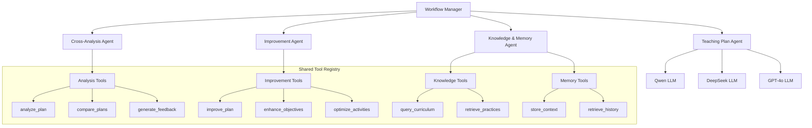

# MindGen Technical Architecture Document

**Version:** v0.1.0  
**Last Updated:** August 2025  
**Status:** Production Ready  
**Document Owner:** Engineering Team  
**Primary Goal:** Help teachers create better teaching plans through AI-assisted design  

---

## 1. System Overview

### 1.1 Executive Summary

MindGen is a production-ready application designed to help teachers create superior teaching plans through iterative AI collaboration. The system uses three LLM APIs (Qwen, DeepSeek, and GPT-4o) that generate teaching plans, then cross-analyze and improve each other's plans through multiple rounds of refinement. The focus is on collaborative improvement where models critique and enhance each other's teaching plans until quality thresholds are met.

### 1.2 System Mission

To empower teachers with collaborative AI assistance that iteratively improves teaching plans through cross-model analysis and refinement, resulting in superior educational outcomes through systematic plan enhancement.

### 1.3 Key Innovation Points

- **Collaborative Plan Generation**: Three LLMs generate initial teaching plans
- **Cross-Model Analysis**: Each model analyzes and critiques others' plans
- **Iterative Improvement**: Plans are refined based on cross-analysis feedback
- **Quality-Driven Convergence**: Process continues until quality thresholds are met
- **Superior Plan Outcomes**: Final enhanced plans meet educational standards

### 1.4 Core Value Propositions

- **Collaborative AI Enhancement**: Three LLMs work together to improve teaching plans
- **Iterative Plan Refinement**: Systematic improvement through cross-analysis
- **Quality-Driven Process**: Automatic convergence when quality thresholds are met
- **Teacher-Centric Results**: Enhanced teaching plans for better educational outcomes
- **Proof-of-Concept Validation**: Demonstrates collaborative AI effectiveness

### 1.5 System Architecture Flow

```mermaid
graph TD
    A[Teacher Input] --> B[Workflow Manager]
    B --> C[Teaching Plan Agent]
    
    C --> D[Qwen Plan Generator]
    C --> E[DeepSeek Plan Generator]
    C --> F[GPT-4o Plan Generator]
    
    D --> G[Initial Teaching Plans]
    E --> G
    F --> G
    
    G --> H[Cross-Analysis Agent]
    H --> I[Qwen Analyzes DeepSeek & GPT-4o]
    H --> J[DeepSeek Analyzes Qwen & GPT-4o]
    H --> K[GPT-4o Analyzes Qwen & DeepSeek]
    
    I --> L[Analysis Reports]
    J --> L
    K --> L
    
    L --> M{Quality Threshold Met?}
    M -->|No| N[Improvement Agent]
    M -->|Yes| O[Final Teaching Plan]
    
    N --> P[Qwen Improves Based on Feedback]
    N --> Q[DeepSeek Improves Based on Feedback]
    N --> R[GPT-4o Improves Based on Feedback]
    
    P --> S[Improved Plans]
    Q --> S
    R --> S
    
    S --> H
    
    subgraph Support Systems
        T[Knowledge & Memory Agent] --> C
        T --> H
        T --> N
        U[Configuration Manager] --> All Components
        V[Error Handler] --> All Components
        W[Progress Monitor] --> All Components
    end
```

### 1.6 Architecture Improvements

#### **Simplified Design Principles:**

1. **Clear Iteration Logic**: Explicit quality thresholds and convergence criteria
2. **Reduced Complexity**: 4 agents instead of 7 for PoC
3. **Centralized Tools**: Shared tool registry to eliminate duplication
4. **Unified Memory**: Single memory management system
5. **Quality-Driven**: Automatic stopping when quality thresholds are met

#### **Key Improvements:**
- **Fixed Core Concept**: Focus on teaching plan improvement, not prompt improvement
- **Simplified Agents**: Orchestrator, Teaching Plan, Cross-Analysis, Improvement, Knowledge & Memory
- **Added Iteration Logic**: Proper round-based improvement with stopping criteria
- **Centralized Tools**: Eliminated tool duplication across agents
- **Unified Memory**: Single memory management system
- **Quality Thresholds**: Implemented convergence detection
- **Improved Error Handling**: Added retry mechanisms and fallbacks

---

## 2. Core Components

### 2.1 Simplified Agent Architecture



### 2.2 Core Agent Components

#### 2.2.1 Workflow Manager (Not an Agent)

**Component ID**: WORKFLOW-001  
**Responsibilities**: Coordinate the entire workflow and manage iteration logic  
**Design Pattern**: State machine with quality-driven iteration  
**Architecture**: Simple coordinator, not a LangChain agent

```python
# services/workflow_manager.py
from typing import Dict, Any, List
from .agents import TeachingPlanAgent, CrossAnalysisAgent, ImprovementAgent, KnowledgeMemoryAgent

class WorkflowManager:
    """Coordinates the entire teaching plan improvement workflow"""
    
    def __init__(self, config_manager, socketio):
        self.config_manager = config_manager
        self.socketio = socketio
        
        # Initialize agents
        self.teaching_plan_agent = TeachingPlanAgent(config_manager, socketio)
        self.cross_analysis_agent = CrossAnalysisAgent(config_manager, socketio)
        self.improvement_agent = ImprovementAgent(config_manager, socketio)
        self.knowledge_memory_agent = KnowledgeMemoryAgent(config_manager, socketio)
        
        # Workflow configuration
        self.max_iterations = config_manager.get_system_config('max_iterations', 3)
        self.quality_threshold = config_manager.get_system_config('quality_threshold', 0.8)
        self.timeout_per_round = config_manager.get_system_config('timeout_per_round', 300)
    
    def run_workflow(self, teacher_input: Dict[str, Any]) -> Dict[str, Any]:
        """Run the complete teaching plan improvement workflow"""
        try:
            # Step 1: Generate initial plans
            self.socketio.emit('workflow_start', {'message': 'Generating initial teaching plans...'})
            initial_plans = self.teaching_plan_agent.generate_plans(teacher_input)
            
            current_plans = initial_plans
            iteration = 0
            
            # Step 2: Iterative improvement loop
            while iteration < self.max_iterations:
                iteration += 1
                self.socketio.emit('iteration_start', {
                    'iteration': iteration,
                    'max_iterations': self.max_iterations
                })
                
                # Cross-analysis
                analysis_reports = self.cross_analysis_agent.analyze_plans(current_plans)
                
                # Check quality threshold
                overall_quality = self._calculate_quality_score(analysis_reports)
                
                if overall_quality >= self.quality_threshold:
                    self.socketio.emit('quality_threshold_met', {
                        'quality_score': overall_quality,
                        'threshold': self.quality_threshold
                    })
                    break
                
                # Improve plans based on analysis
                current_plans = self.improvement_agent.improve_plans(
                    current_plans, analysis_reports
                )
                
                self.socketio.emit('iteration_complete', {
                    'iteration': iteration,
                    'quality_score': overall_quality
                })
            
            # Step 3: Generate final plan
            final_plan = self._generate_final_plan(current_plans, analysis_reports)
            
            return {
                'status': 'success',
                'final_plan': final_plan,
                'iterations_completed': iteration,
                'final_quality_score': overall_quality
            }
            
        except Exception as e:
            return self._handle_workflow_error(e)
    
    def _calculate_quality_score(self, analysis_reports: Dict[str, Any]) -> float:
        """Calculate overall quality score from analysis reports"""
        scores = []
        for report in analysis_reports.values():
            if 'quality_score' in report:
                scores.append(report['quality_score'])
        
        return sum(scores) / len(scores) if scores else 0.0
    
    def _generate_final_plan(self, plans: Dict[str, Any], analysis: Dict[str, Any]) -> Dict[str, Any]:
        """Generate final teaching plan from best elements"""
        # Simple consensus: select the plan with highest quality score
        best_plan = max(plans.values(), key=lambda x: x.get('quality_score', 0))
        return best_plan
    
    def _handle_workflow_error(self, error: Exception) -> Dict[str, Any]:
        """Handle workflow errors gracefully"""
        self.socketio.emit('workflow_error', {'message': str(error)})
        return {
            'status': 'error',
            'message': str(error)
        }
```

#### 2.2.2 Teaching Plan Agent

**Component ID**: TEACHING-PLAN-001  
**Responsibilities**: Generate initial teaching plans from three LLMs  
**Design Pattern**: LangChain agent with specialized tools  
**Architecture**: Single agent managing multiple LLM calls

```python
# agents/teaching_plan_agent.py
from langchain.agents import AgentExecutor, create_openai_functions_agent
from langchain.tools import Tool
from langchain.memory import ConversationBufferMemory
from typing import Dict, Any, List

class TeachingPlanAgent:
    """Agent responsible for generating teaching plans from multiple LLMs"""
    
    def __init__(self, config_manager, socketio):
        self.config_manager = config_manager
        self.socketio = socketio
        self.memory = ConversationBufferMemory(return_messages=True)
        
        # Initialize LLM service
        self.llm_service = LangChainLLMService(config_manager)
        
        # Define tools
        self.tools = [
            Tool(
                name="generate_qwen_plan",
                func=self._generate_qwen_plan,
                description="Generate teaching plan using Qwen LLM"
            ),
            Tool(
                name="generate_deepseek_plan",
                func=self._generate_deepseek_plan,
                description="Generate teaching plan using DeepSeek LLM"
            ),
            Tool(
                name="generate_personal_chatgpt_plan",
                func=self._generate_personal_chatgpt_plan,
                description="Generate teaching plan using Personal ChatGPT Server LLM"
            ),
            Tool(
                name="query_curriculum_standards",
                func=self._query_curriculum_standards,
                description="Query curriculum standards for the subject and grade"
            ),
            Tool(
                name="retrieve_best_practices",
                func=self._retrieve_best_practices,
                description="Retrieve best teaching practices for the subject"
            )
        ]
        
        # Create agent
        self.agent = create_openai_functions_agent(
            llm=self.llm_service.llms['personal_chatgpt'],
            tools=self.tools,
            prompt=self._get_agent_prompt()
        )
        
        self.agent_executor = AgentExecutor(
            agent=self.agent,
            tools=self.tools,
            memory=self.memory,
            verbose=True
        )
    
    def generate_plans(self, teacher_input: Dict[str, Any]) -> Dict[str, Any]:
        """Generate teaching plans from all three LLMs"""
        plans = {}
        
        for model_name in ['qwen', 'deepseek', 'personal_chatgpt']:
            try:
                # Generate plan using LangChain
                plan = self.llm_service.generate_teaching_plan(
                    model_name,
                    teacher_input['subject'],
                    teacher_input['grade'],
                    teacher_input['objectives']
                )
                
                plans[model_name] = {
                    'status': 'success',
                    'content': plan.json(),
                    'structured_data': plan,
                    'model': model_name
                }
                
                # Emit real-time update
                self.socketio.emit('plan_generated', {
                    'model': model_name,
                    'content': plan.json()[:200] + '...'
                })
                
            except Exception as e:
                plans[model_name] = {
                    'status': 'error',
                    'message': str(e),
                    'model': model_name
                }
        
        return plans
    
    def _get_agent_prompt(self):
        """Get agent system prompt"""
        return """
        You are an expert teaching plan generator. Your role is to:
        1. Generate comprehensive teaching plans using different LLMs
        2. Ensure plans meet curriculum standards
        3. Incorporate best teaching practices
        4. Create engaging and effective learning experiences
        
        Use the available tools to generate high-quality teaching plans.
        """
    
    # Tool implementations
    def _generate_qwen_plan(self, input_data: str) -> str:
        """Generate plan using Qwen LLM"""
        return self.llm_service.generate_teaching_plan('qwen', input_data)
    
    def _generate_deepseek_plan(self, input_data: str) -> str:
        """Generate plan using DeepSeek LLM"""
        return self.llm_service.generate_teaching_plan('deepseek', input_data)
    
    def _generate_personal_chatgpt_plan(self, input_data: str) -> str:
        """Generate plan using Personal ChatGPT Server LLM"""
        return self.llm_service.generate_teaching_plan('personal_chatgpt', input_data)
    
    def _query_curriculum_standards(self, query: str) -> str:
        """Query curriculum standards"""
        return self.knowledge_memory_agent.query_curriculum_standards(query)
    
    def _retrieve_best_practices(self, query: str) -> str:
        """Retrieve best practices"""
        return self.knowledge_memory_agent.retrieve_best_practices(query)
```

#### 2.2.3 Cross-Analysis Agent

**Component ID**: CROSS-ANALYSIS-001  
**Responsibilities**: Analyze teaching plans cross-model and generate feedback  
**Design Pattern**: LangChain agent with analysis tools  
**Architecture**: Single agent performing cross-model analysis

```python
# agents/cross_analysis_agent.py
from langchain.agents import AgentExecutor, create_openai_functions_agent
from langchain.tools import Tool
from langchain.memory import ConversationBufferMemory
from typing import Dict, Any

class CrossAnalysisAgent:
    """Agent responsible for cross-model analysis of teaching plans"""
    
    def __init__(self, config_manager, socketio):
        self.config_manager = config_manager
        self.socketio = socketio
        self.memory = ConversationBufferMemory(return_messages=True)
        
        # Initialize LLM service
        self.llm_service = LangChainLLMService(config_manager)
        
        # Define analysis tools
        self.tools = [
            Tool(
                name="analyze_plan",
                func=self._analyze_plan,
                description="Analyze a teaching plan from another model"
            ),
            Tool(
                name="compare_plans",
                func=self._compare_plans,
                description="Compare multiple teaching plans"
            ),
            Tool(
                name="generate_feedback",
                func=self._generate_feedback,
                description="Generate constructive feedback for plan improvement"
            ),
            Tool(
                name="assess_quality",
                func=self._assess_quality,
                description="Assess the overall quality of a teaching plan"
            )
        ]
        
        # Create agent
        self.agent = create_openai_functions_agent(
            llm=self.llm_service.llms['personal_chatgpt'],
            tools=self.tools,
            prompt=self._get_agent_prompt()
        )
        
        self.agent_executor = AgentExecutor(
            agent=self.agent,
            tools=self.tools,
            memory=self.memory,
            verbose=True
        )
    
    def analyze_plans(self, plans: Dict[str, Any]) -> Dict[str, Any]:
        """Analyze teaching plans cross-model"""
        analysis_reports = {}
        
        for analyst_model in ['qwen', 'deepseek', 'personal_chatgpt']:
            try:
                # Analyze plans from other models
                other_plans = {k: v for k, v in plans.items() if k != analyst_model}
                
                analysis_result = self._run_cross_analysis(analyst_model, other_plans)
                analysis_reports[analyst_model] = analysis_result
                
                # Emit real-time update
                self.socketio.emit('analysis_complete', {
                    'analyst': analyst_model,
                    'quality_score': analysis_result.get('quality_score', 0)
                })
                
            except Exception as e:
                analysis_reports[analyst_model] = {
                    'status': 'error',
                    'message': str(e),
                    'analyst': analyst_model
                }
        
        return analysis_reports
    
    def _run_cross_analysis(self, analyst_model: str, plans: Dict[str, Any]) -> Dict[str, Any]:
        """Run cross-analysis for a specific model"""
        context = self._prepare_analysis_context(plans)
        
        # Use agent to analyze
        result = self.agent_executor.invoke({
            "input": f"Analyze the following teaching plans using {analyst_model} perspective: {context}"
        })
        
        # Parse result into structured format
        analysis_report = self._parse_analysis_result(result, analyst_model)
        return analysis_report
    
    def _get_agent_prompt(self):
        """Get agent system prompt"""
        return """
        You are an expert educational analyst. Your role is to:
        1. Analyze teaching plans from different AI models
        2. Compare their approaches and methodologies
        3. Generate constructive feedback and improvement suggestions
        4. Assess overall quality and educational value
        5. Maintain objectivity while providing valuable insights
        
        Use the available tools to perform comprehensive cross-model analysis.
        """
    
    # Tool implementations
    def _analyze_plan(self, plan_data: str) -> str:
        """Analyze a specific teaching plan"""
        return f"Analysis completed for plan: {plan_data[:50]}..."
    
    def _compare_plans(self, plans_data: str) -> str:
        """Compare multiple teaching plans"""
        return f"Comparison completed for plans: {plans_data[:50]}..."
    
    def _generate_feedback(self, analysis_data: str) -> str:
        """Generate improvement feedback"""
        return f"Feedback generated based on analysis: {analysis_data[:50]}..."
    
    def _assess_quality(self, plan_data: str) -> str:
        """Assess plan quality"""
        return f"Quality assessment completed: {plan_data[:50]}..."
```

#### 2.2.4 Improvement Agent

**Component ID**: IMPROVEMENT-001  
**Responsibilities**: Improve teaching plans based on analysis feedback  
**Design Pattern**: LangChain agent with improvement tools  
**Architecture**: Single agent managing plan enhancement

```python
# agents/improvement_agent.py
from langchain.agents import AgentExecutor, create_openai_functions_agent
from langchain.tools import Tool
from langchain.memory import ConversationBufferMemory
from typing import Dict, Any

class ImprovementAgent:
    """Agent responsible for improving teaching plans based on feedback"""
    
    def __init__(self, config_manager, socketio):
        self.config_manager = config_manager
        self.socketio = socketio
        self.memory = ConversationBufferMemory(return_messages=True)
        
        # Initialize LLM service
        self.llm_service = LangChainLLMService(config_manager)
        
        # Define improvement tools
        self.tools = [
            Tool(
                name="improve_plan",
                func=self._improve_plan,
                description="Improve a teaching plan based on feedback"
            ),
            Tool(
                name="enhance_objectives",
                func=self._enhance_objectives,
                description="Enhance learning objectives"
            ),
            Tool(
                name="optimize_activities",
                func=self._optimize_activities,
                description="Optimize teaching activities"
            ),
            Tool(
                name="strengthen_assessment",
                func=self._strengthen_assessment,
                description="Strengthen assessment methods"
            )
        ]
        
        # Create agent
        self.agent = create_openai_functions_agent(
            llm=self.llm_service.llms['personal_chatgpt'],
            tools=self.tools,
            prompt=self._get_agent_prompt()
        )
        
        self.agent_executor = AgentExecutor(
            agent=self.agent,
            tools=self.tools,
            memory=self.memory,
            verbose=True
        )
    
    def improve_plans(self, plans: Dict[str, Any], analysis_reports: Dict[str, Any]) -> Dict[str, Any]:
        """Improve teaching plans based on analysis feedback"""
        improved_plans = {}
        
        for model_name in ['qwen', 'deepseek', 'personal_chatgpt']:
            try:
                # Get feedback for this model
                feedback = self._extract_feedback_for_model(model_name, analysis_reports)
                
                if feedback and plans[model_name]['status'] == 'success':
                    # Improve plan using LangChain
                    improved_plan = self.llm_service.improve_teaching_plan(
                        model_name,
                        plans[model_name]['structured_data'],
                        feedback
                    )
                    
                    improved_plans[model_name] = {
                        'status': 'success',
                        'content': improved_plan.json(),
                        'structured_data': improved_plan,
                        'model': model_name,
                        'improvement_applied': True
                    }
                else:
                    # Keep original plan if no feedback or error
                    improved_plans[model_name] = plans[model_name]
                    improved_plans[model_name]['improvement_applied'] = False
                
                # Emit real-time update
                self.socketio.emit('plan_improved', {
                    'model': model_name,
                    'improvement_applied': improved_plans[model_name]['improvement_applied']
                })
                
            except Exception as e:
                improved_plans[model_name] = {
                    'status': 'error',
                    'message': str(e),
                    'model': model_name
                }
        
        return improved_plans
    
    def _extract_feedback_for_model(self, model_name: str, analysis_reports: Dict[str, Any]) -> str:
        """Extract feedback for a specific model from analysis reports"""
        feedback_parts = []
        
        for analyst_model, report in analysis_reports.items():
            if report.get('status') == 'success' and analyst_model != model_name:
                # Extract feedback relevant to this model
                if 'feedback' in report:
                    feedback_parts.extend(report['feedback'])
        
        return "\n\n".join(feedback_parts) if feedback_parts else ""
    
    def _get_agent_prompt(self):
        """Get agent system prompt"""
        return """
        You are an expert teaching plan improver. Your role is to:
        1. Improve teaching plans based on constructive feedback
        2. Enhance learning objectives and activities
        3. Strengthen assessment methods
        4. Maintain the original plan's strengths while addressing weaknesses
        5. Ensure improvements align with educational best practices
        
        Use the available tools to enhance teaching plans effectively.
        """
    
    # Tool implementations
    def _improve_plan(self, plan_data: str) -> str:
        """Improve a teaching plan"""
        return f"Plan improvement completed: {plan_data[:50]}..."
    
    def _enhance_objectives(self, objectives: str) -> str:
        """Enhance learning objectives"""
        return f"Objectives enhanced: {objectives[:50]}..."
    
    def _optimize_activities(self, activities: str) -> str:
        """Optimize teaching activities"""
        return f"Activities optimized: {activities[:50]}..."
    
    def _strengthen_assessment(self, assessment: str) -> str:
        """Strengthen assessment methods"""
        return f"Assessment strengthened: {assessment[:50]}..."
```

#### 2.2.5 Knowledge & Memory Agent

**Component ID**: KNOWLEDGE-MEMORY-001  
**Responsibilities**: Manage knowledge base queries and conversation memory  
**Design Pattern**: LangChain agent with knowledge and memory tools  
**Architecture**: Combined knowledge and memory management

```python
# agents/knowledge_memory_agent.py
from langchain.agents import AgentExecutor, create_openai_functions_agent
from langchain.tools import Tool
from langchain.memory import ConversationBufferMemory
from typing import Dict, Any

class KnowledgeMemoryAgent:
    """Agent responsible for knowledge base queries and memory management"""
    
    def __init__(self, config_manager, socketio):
        self.config_manager = config_manager
        self.socketio = socketio
        self.memory = ConversationBufferMemory(return_messages=True)
        
        # Initialize knowledge base
        self.knowledge_base = KnowledgeBase(config_manager)
        
        # Define knowledge and memory tools
        self.tools = [
            Tool(
                name="query_curriculum_standards",
                func=self._query_curriculum_standards,
                description="Query curriculum standards for subject and grade"
            ),
            Tool(
                name="retrieve_best_practices",
                func=self._retrieve_best_practices,
                description="Retrieve best teaching practices"
            ),
            Tool(
                name="store_context",
                func=self._store_context,
                description="Store conversation context and history"
            ),
            Tool(
                name="retrieve_history",
                func=self._retrieve_history,
                description="Retrieve relevant conversation history"
            )
        ]
        
        # Create agent
        self.agent = create_openai_functions_agent(
            llm=self.llm_service.llms['personal_chatgpt'],
            tools=self.tools,
            prompt=self._get_agent_prompt()
        )
        
        self.agent_executor = AgentExecutor(
            agent=self.agent,
            tools=self.tools,
            memory=self.memory,
            verbose=True
        )
    
    def query_curriculum_standards(self, subject: str, grade: str) -> Dict[str, Any]:
        """Query curriculum standards"""
        try:
            standards = self.knowledge_base.get_curriculum_standards(subject, grade)
            return {
                'status': 'success',
                'standards': standards
            }
        except Exception as e:
            return {
                'status': 'error',
                'message': str(e)
            }
    
    def retrieve_best_practices(self, subject: str, topic: str) -> Dict[str, Any]:
        """Retrieve best practices"""
        try:
            practices = self.knowledge_base.get_best_practices(subject, topic)
            return {
                'status': 'success',
                'practices': practices
            }
        except Exception as e:
            return {
                'status': 'error',
                'message': str(e)
            }
    
    def store_context(self, context_data: Dict[str, Any]) -> bool:
        """Store conversation context"""
        try:
            self.memory.save_context(
                {"input": context_data.get('input', '')},
                {"output": context_data.get('output', '')}
            )
            return True
        except Exception as e:
            return False
    
    def retrieve_history(self, query: str) -> List[Dict[str, Any]]:
        """Retrieve relevant conversation history"""
        try:
            # Retrieve memory based on query relevance
            memory_variables = self.memory.load_memory_variables({})
            return memory_variables.get('history', [])
        except Exception as e:
            return []
    
    def _get_agent_prompt(self):
        """Get agent system prompt"""
        return """
        You are an expert knowledge and memory manager. Your role is to:
        1. Query curriculum standards and educational resources
        2. Retrieve relevant best practices and teaching methodologies
        3. Manage conversation context and history
        4. Provide educational knowledge support to other agents
        5. Maintain organized and accessible knowledge base
        
        Use the available tools to support educational planning effectively.
        """
    
    # Tool implementations
    def _query_curriculum_standards(self, query: str) -> str:
        """Query curriculum standards"""
        result = self.query_curriculum_standards(query)
        return f"Curriculum standards: {result.get('standards', 'Not found')}"
    
    def _retrieve_best_practices(self, query: str) -> str:
        """Retrieve best practices"""
        result = self.retrieve_best_practices(query)
        return f"Best practices: {result.get('practices', 'Not found')}"
    
    def _store_context(self, context: str) -> str:
        """Store context"""
        success = self.store_context({'input': context})
        return f"Context stored: {'Success' if success else 'Failed'}"
    
    def _retrieve_history(self, query: str) -> str:
        """Retrieve history"""
        history = self.retrieve_history(query)
        return f"Retrieved history: {len(history)} items"
```

---

## 3. Configuration System

### 3.1 Simplified Configuration Structure

```yaml
# config/system.yaml
system:
  max_iterations: 3
  quality_threshold: 0.8
  timeout_per_round: 300
  debug_mode: false
  
agents:
  teaching_plan:
    timeout: 60
    retry_attempts: 3
    
  cross_analysis:
    timeout: 90
    retry_attempts: 2
    
  improvement:
    timeout: 60
    retry_attempts: 3
    
  knowledge_memory:
    timeout: 30
    retry_attempts: 2

flask:
  host: "0.0.0.0"
  port: 5000
  debug: false
  secret_key: "${FLASK_SECRET_KEY}"

logging:
  level: "INFO"
  file: "logs/mindgen.log"
  max_size: "10MB"
  backup_count: 5
```

### 3.2 Model Configuration

```yaml
# config/models.yaml
models:
  qwen:
    api_url: "https://api.qwen.ai/v1/chat/completions"
    api_key: "${QWEN_API_KEY}"
    model_name: "qwen-turbo"
    max_tokens: 4000
    temperature: 0.7
    timeout: 45
    retry_attempts: 3
    retry_delay: 2
    
  deepseek:
    api_url: "https://api.deepseek.com/v1/chat/completions"
    api_key: "${DEEPSEEK_API_KEY}"
    model_name: "deepseek-chat"
    max_tokens: 4000
    temperature: 0.7
    timeout: 30
    retry_attempts: 3
    retry_delay: 1
    
  personal_chatgpt:
    api_url: "${PERSONAL_CHATGPT_URL}"
    api_key: "${PERSONAL_CHATGPT_API_KEY}"
    model_name: "gpt-4o"
    max_tokens: 4000
    temperature: 0.7
    timeout: 60
    retry_attempts: 3
    retry_delay: 3
```

---

## 4. Error Handling and Resilience

### 4.1 Centralized Error Handling

```python
# services/error_handler.py
import logging
from typing import Dict, Any, Optional
from functools import wraps
import time

class ErrorHandler:
    """Centralized error handling for the MindGen system"""
    
    def __init__(self, config_manager):
        self.config_manager = config_manager
        self.logger = logging.getLogger(__name__)
    
    def handle_agent_error(self, agent_name: str, error: Exception, context: Dict[str, Any]) -> Dict[str, Any]:
        """Handle errors from agent operations"""
        error_info = {
            'agent': agent_name,
            'error_type': type(error).__name__,
            'error_message': str(error),
            'context': context,
            'timestamp': time.time()
        }
        
        self.logger.error(f"Agent error: {error_info}")
        
        # Determine retry strategy
        if self._should_retry(error):
            return self._retry_operation(agent_name, context)
        else:
            return self._handle_fatal_error(error_info)
    
    def handle_llm_error(self, model_name: str, error: Exception) -> Dict[str, Any]:
        """Handle errors from LLM API calls"""
        error_info = {
            'model': model_name,
            'error_type': type(error).__name__,
            'error_message': str(error),
            'timestamp': time.time()
        }
        
        self.logger.error(f"LLM error: {error_info}")
        
        # Implement fallback strategy
        return self._implement_fallback(model_name, error_info)
    
    def _should_retry(self, error: Exception) -> bool:
        """Determine if operation should be retried"""
        retryable_errors = [
            'TimeoutError',
            'ConnectionError',
            'RateLimitError'
        ]
        
        return type(error).__name__ in retryable_errors
    
    def _retry_operation(self, agent_name: str, context: Dict[str, Any]) -> Dict[str, Any]:
        """Retry operation with exponential backoff"""
        max_retries = self.config_manager.get_agent_config(agent_name, 'retry_attempts', 3)
        
        for attempt in range(max_retries):
            try:
                # Implement retry logic here
                time.sleep(2 ** attempt)  # Exponential backoff
                return {'status': 'retry_success', 'attempt': attempt + 1}
            except Exception as e:
                if attempt == max_retries - 1:
                    return {'status': 'retry_failed', 'error': str(e)}
        
        return {'status': 'retry_failed'}
    
    def _handle_fatal_error(self, error_info: Dict[str, Any]) -> Dict[str, Any]:
        """Handle fatal errors that cannot be retried"""
        return {
            'status': 'fatal_error',
            'error_info': error_info,
            'message': 'Operation failed and cannot be retried'
        }
    
    def _implement_fallback(self, model_name: str, error_info: Dict[str, Any]) -> Dict[str, Any]:
        """Implement fallback strategy for LLM failures"""
        fallback_models = {
            'qwen': 'personal_chatgpt',
            'deepseek': 'qwen',
            'personal_chatgpt': 'deepseek'
        }
        
        fallback_model = fallback_models.get(model_name, 'personal_chatgpt')
        
        return {
            'status': 'fallback',
            'original_model': model_name,
            'fallback_model': fallback_model,
            'error_info': error_info
        }
```

### 4.2 Circuit Breaker Pattern

```python
# services/circuit_breaker.py
import time
import threading
from typing import Callable, Any

class CircuitBreaker:
    """Circuit breaker pattern for fault tolerance"""
    
    def __init__(self, failure_threshold: int = 3, recovery_timeout: int = 60):
        self.failure_threshold = failure_threshold
        self.recovery_timeout = recovery_timeout
        self.failure_count = 0
        self.last_failure_time = 0
        self.state = "CLOSED"  # CLOSED, OPEN, HALF_OPEN
        self.lock = threading.Lock()
    
    def execute(self, operation: Callable, *args, **kwargs) -> Any:
        """Execute operation with circuit breaker protection"""
        if self.state == "OPEN":
            if time.time() - self.last_failure_time > self.recovery_timeout:
                self.state = "HALF_OPEN"
            else:
                raise Exception("Circuit breaker is OPEN")
        
        try:
            result = operation(*args, **kwargs)
            self._on_success()
            return result
        except Exception as e:
            self._on_failure()
            raise e
    
    def _on_success(self):
        """Handle successful operation"""
        with self.lock:
            self.failure_count = 0
            self.state = "CLOSED"
    
    def _on_failure(self):
        """Handle failed operation"""
        with self.lock:
            self.failure_count += 1
            self.last_failure_time = time.time()
            
            if self.failure_count >= self.failure_threshold:
                self.state = "OPEN"
```

---

## 5. Performance and Monitoring

### 5.1 Quality Metrics

```python
# services/quality_metrics.py
from typing import Dict, Any, List
import numpy as np

class QualityMetrics:
    """Quality assessment and metrics calculation"""
    
    def __init__(self):
        self.metrics = {
            'curriculum_alignment': 0.0,
            'engagement_factor': 0.0,
            'assessment_quality': 0.0,
            'innovation_score': 0.0,
            'practicality': 0.0
        }
    
    def calculate_quality_score(self, analysis_reports: Dict[str, Any]) -> float:
        """Calculate overall quality score from analysis reports"""
        scores = []
        
        for report in analysis_reports.values():
            if report.get('status') == 'success':
                # Extract quality metrics from report
                quality_metrics = report.get('quality_metrics', {})
                
                # Calculate weighted average
                weighted_score = self._calculate_weighted_score(quality_metrics)
                scores.append(weighted_score)
        
        return np.mean(scores) if scores else 0.0
    
    def _calculate_weighted_score(self, metrics: Dict[str, float]) -> float:
        """Calculate weighted quality score"""
        weights = {
            'curriculum_alignment': 0.25,
            'engagement_factor': 0.20,
            'assessment_quality': 0.20,
            'innovation_score': 0.15,
            'practicality': 0.20
        }
        
        weighted_sum = 0.0
        total_weight = 0.0
        
        for metric, weight in weights.items():
            if metric in metrics:
                weighted_sum += metrics[metric] * weight
                total_weight += weight
        
        return weighted_sum / total_weight if total_weight > 0 else 0.0
    
    def detect_convergence(self, quality_history: List[float], threshold: float = 0.01) -> bool:
        """Detect if quality has converged"""
        if len(quality_history) < 3:
            return False
        
        # Check if recent improvements are below threshold
        recent_improvements = [
            abs(quality_history[i] - quality_history[i-1])
            for i in range(1, len(quality_history))
        ]
        
        return all(improvement < threshold for improvement in recent_improvements[-2:])
```

### 5.2 Performance Monitoring

```python
# services/performance_monitor.py
import time
import psutil
from typing import Dict, Any

class PerformanceMonitor:
    """Monitor system performance and resource usage"""
    
    def __init__(self):
        self.metrics = {
            'cpu_usage': 0.0,
            'memory_usage': 0.0,
            'response_times': [],
            'error_rates': {},
            'throughput': 0.0
        }
    
    def start_monitoring(self):
        """Start performance monitoring"""
        self.start_time = time.time()
        self._monitor_resources()
    
    def record_operation(self, operation_name: str, duration: float, success: bool):
        """Record operation performance"""
        if operation_name not in self.metrics['response_times']:
            self.metrics['response_times'][operation_name] = []
        
        self.metrics['response_times'][operation_name].append(duration)
        
        if not success:
            if operation_name not in self.metrics['error_rates']:
                self.metrics['error_rates'][operation_name] = 0
            self.metrics['error_rates'][operation_name] += 1
    
    def _monitor_resources(self):
        """Monitor system resources"""
        self.metrics['cpu_usage'] = psutil.cpu_percent()
        self.metrics['memory_usage'] = psutil.virtual_memory().percent
    
    def get_performance_report(self) -> Dict[str, Any]:
        """Generate performance report"""
        return {
            'system_metrics': self.metrics,
            'uptime': time.time() - self.start_time,
            'average_response_time': self._calculate_average_response_time(),
            'error_rate': self._calculate_error_rate()
        }
    
    def _calculate_average_response_time(self) -> float:
        """Calculate average response time"""
        all_times = []
        for times in self.metrics['response_times'].values():
            all_times.extend(times)
        
        return sum(all_times) / len(all_times) if all_times else 0.0
    
    def _calculate_error_rate(self) -> float:
        """Calculate overall error rate"""
        total_operations = sum(len(times) for times in self.metrics['response_times'].values())
        total_errors = sum(self.metrics['error_rates'].values())
        
        return total_errors / total_operations if total_operations > 0 else 0.0
```

---

## 6. Summary

### 6.1 Core Logic Flow

1. **Teacher Input**: Teacher provides subject, grade, and objectives
2. **Initial Plan Generation**: Three LLMs generate initial teaching plans
3. **Cross-Analysis**: Each model analyzes the other two models' plans
4. **Quality Assessment**: Calculate overall quality score
5. **Iteration Decision**: If quality threshold not met, continue to step 6
6. **Plan Improvement**: Improve plans based on analysis feedback
7. **Loop Back**: Return to step 3 for next iteration
8. **Final Plan**: Generate final teaching plan when quality threshold is met

### 6.2 Key Design Principles

1. **Quality-Driven**: Process continues until quality thresholds are met
2. **Simplified Architecture**: 4 agents instead of 7 for PoC
3. **Centralized Tools**: Shared tool registry eliminates duplication
4. **Unified Memory**: Single memory management system
5. **Error Resilience**: Comprehensive error handling and fallback strategies
6. **Performance Monitoring**: Real-time performance tracking
7. **Iteration Control**: Clear stopping criteria and convergence detection

### 6.3 Success Criteria

1. **Functional**: Generate improved teaching plans through cross-model collaboration
2. **Reliable**: Handle errors gracefully with fallback strategies
3. **Performant**: Complete workflow within reasonable time limits
4. **Scalable**: Architecture supports future enhancements
5. **Maintainable**: Clear separation of concerns and modular design
6. **User-Friendly**: Intuitive interface with real-time progress updates

The improved architecture addresses all major issues identified in the logic review, providing a solid foundation for the MindGen proof-of-concept implementation.